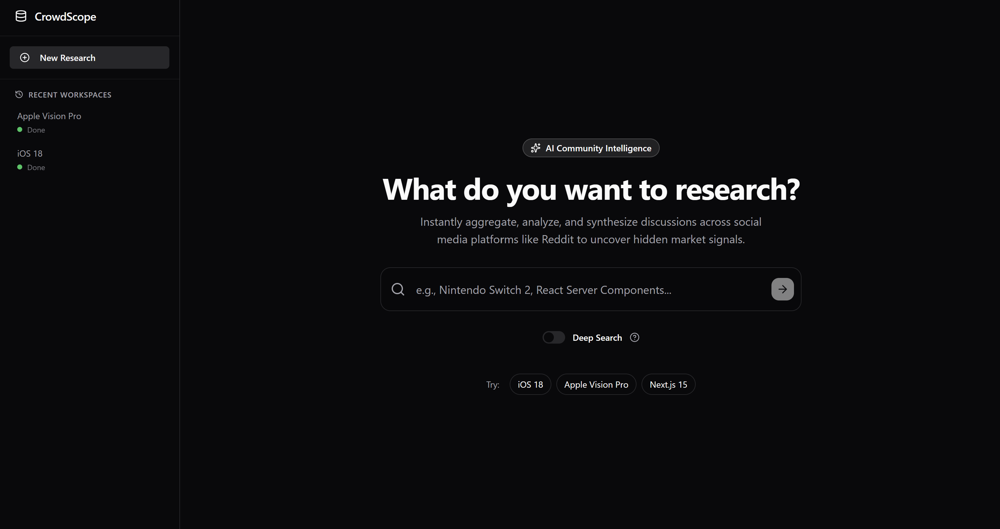
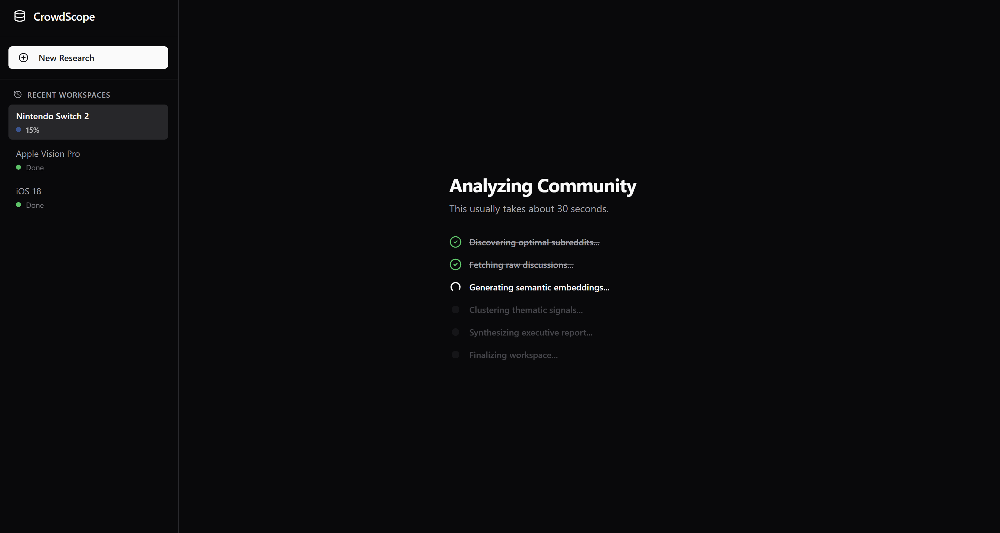

# CrowdScope: AI-Powered Market Intelligence Platform



**CrowdScope** is an AI-powered market intelligence platform that transforms unstructured Reddit discussions into structured executive reports. It combines semantic embeddings, density-based clustering, and Large Language Models (LLMs) to uncover customer pain points, feature requests, competitive insights, and emerging market trends.

Unlike traditional sentiment analysis tools, CrowdScope groups discussions based on **semantic similarity**, allowing it to discover meaningful topics without predefined labels.

---

## Features

- Semantic topic discovery using Sentence Transformers and HDBSCAN
- Executive market reports generated with Gemini AI
- Explainable insights backed by representative Reddit discussions
- Asynchronous research pipeline with live progress tracking
- Persistent research workspaces stored in PostgreSQL
- Fully containerized microservice architecture
- Automated CI/CD deployment to AWS using GitHub Actions

---

# Research Pipeline

```text
User Query
     │
     ▼
Entity & Subreddit Discovery
     │
     ▼
Reddit Retrieval
     │
     ▼
Sentence Embeddings
     │
     ▼
HDBSCAN Semantic Clustering
     │
     ▼
Representative Selection (MMR)
     │
     ▼
Cluster Summarization (Gemini)
     │
     ▼
Executive Report Generation
```

Each research request executes asynchronously, with intermediate results persisted in PostgreSQL so users can revisit previous reports without recomputation.

---

# System Architecture

```text
                    React Frontend (Vercel)
                            │
                            ▼
                  Express API (Node.js)
                            │
         ┌──────────────────┴──────────────────┐
         ▼                                     ▼
 PostgreSQL (Prisma)                FastAPI ML Service
                                             │
                    ┌────────────────────────┴────────────────────────┐
                    ▼                                                 ▼
             Reddit Retrieval                               Semantic Pipeline
                 (PRAW)                              Sentence Transformers
                                                             │
                                                         HDBSCAN
                                                             │
                                                             ▼
                                                       Gemini AI
```

---

# Key Features

## Semantic Clustering

Instead of relying on keyword matching, CrowdScope generates dense semantic embeddings using **BAAI/bge-small-en-v1.5** and groups related discussions with **HDBSCAN**, automatically discovering meaningful conversation themes.

---

## Executive Intelligence

Each semantic cluster is summarized using **Gemini AI** to extract:

- Executive Summary
- Discussion Landscape
- Strengths
- Pain Points
- Feature Requests
- Competitor Mentions
- Risks
- Opportunities
- Strategic Recommendations

---

## Explainable AI

Every generated insight is traceable back to representative Reddit discussions selected using **Maximal Marginal Relevance (MMR)**, providing transparency instead of black-box AI outputs.

---

## Persistent Research Workspaces

Research sessions are stored in PostgreSQL, allowing users to:

- revisit previous reports
- monitor research progress
- inspect semantic clusters
- explore supporting discussions

---

# Tech Stack

## Frontend

- React
- Vite
- Tailwind CSS
- Axios

## Backend

- Node.js
- Express.js
- FastAPI
- Prisma ORM
- PostgreSQL

## AI & Machine Learning

- Sentence Transformers
- HDBSCAN
- Gemini AI
- Scikit-learn
- PyTorch
- PRAW (Reddit API)

## DevOps & Infrastructure

- Docker
- Docker Compose
- Nginx
- AWS EC2
- GitHub Actions
- GitHub Container Registry (GHCR)
- Vercel

---

# Local Development

## Prerequisites

- Docker Desktop
- Reddit API credentials
- Gemini API key

Create a `.env` file:

```env
REDDIT_CLIENT_ID=
REDDIT_CLIENT_SECRET=
REDDIT_USER_AGENT=

GEMINI_API_KEY=

POSTGRES_PASSWORD=

CLIENT_URL=http://localhost:5173
```

Build and start the entire stack:

```bash
docker compose up -d --build
```

Initialize the database:

```bash
docker compose exec express-backend npx prisma db push
```

Open:

```
Frontend:
http://localhost:5173

Backend:
http://localhost:5000
```

---

# Production Deployment

CrowdScope uses a fully automated CI/CD pipeline.

```text
Git Push
     │
     ▼
GitHub Actions
     │
     ▼
Build Docker Images
     │
     ▼
Push Images to GHCR
     │
     ▼
SSH into AWS EC2
     │
     ▼
docker compose pull
     │
     ▼
docker compose up -d
```

Infrastructure includes:

- Docker Compose
- Nginx Reverse Proxy
- HTTPS via Let's Encrypt
- GitHub Container Registry
- GitHub Actions
- AWS EC2

---

# Screenshots

### Home




---

# Roadmap

- Competitive analysis across multiple products
- Conversational follow-up research
- Multi-source ingestion (Reddit, X, Hacker News)
- Interactive semantic cluster visualization
- Authentication and team workspaces
- Advanced analytics dashboard

---

# License

MIT License